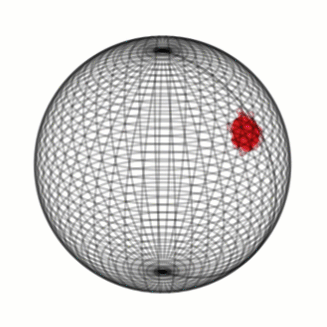

# Anomaly Detection with SDE

```bash
python generate_very_simple_data.py
python basic_data_interpolation.py --enable-file-logging --log-dir logs \
  --enable-checkpointing --checkpoint-dir checkpoints --checkpoint-at 90 390 990 2190 3990 \
  --lr 0.05 --n-epochs 3990 --kl0-weight 0.001 --klp-weight 0.01 \
  --pxz-weight 1.0 --seed -1 --restart 30 --device cuda:0 --z-dim 3 --h-dim 3 \
  --n-deg 6 --no-learnable-prior --freeze-sigma --mc-eval-samples 10 \
  --mc-train-samples 10 --loglevel debug
```

# Latent SDEs on Homogeneous Spaces
<p align="center">
  
</p>

This repository contains the **reference implementation** of

Zeng, S. and Graf, F. and Kwitt, R.
**Latent SDEs on Homogeneous Spaces**
*NeurIPS 2023*

Please cite as:

```bibtex
@inproceedings{Zeng23a,
    author    = {Zeng, Sebastian and Graf, Florian and Kwitt, Roland},
    title     = {Latent SDEs on Homogeneous Spaces},
    booktitle = {NeurIPS},
    year      = {2023}}
```
A preprint is available on [arXiv](https://arxiv.org/abs/2306.16248). In the following, we refer to the
paper as [**Zeng23a**].

We attach the [poster](/assets/NeurIPS23_poster.pdf) and [presentation slides](/assets/NeurIPS23_slides.pdf) that were presented at NeurIPS 2023.

Documentation for the experiments of the  Neurips 2023 paper is to be found [here](doc/latent_sde_on_hs.md).
# Overview

- [Setup](#setup)

# Setup

### Example setup

The following example (1) sets up Anaconda Python (2023.09) in `/tmp/anaconda3`, (2) creates and activates a virtual environment `pytorch211`, (3) installs PyTorch 2.1.1 (according to the [PyTorch](https://pytorch.org/) installation instructions as of Dec. 2023) and (4) installs all dependencies, i.e., `einops, scipy, scikit-learn` and `gdown`. Assumes that the installed
CUDA version is 12.1.

```bash
cd /tmp/
wget https://repo.anaconda.com/archive/Anaconda3-2023.09-0-Linux-x86_64.sh
chmod +x Anaconda3-2023.09-0-Linux-x86_64.sh
./Anaconda3-2023.09-0-Linux-x86_64.sh -p /tmp/anaconda3
source source /tmp/anaconda3/bin/activate
conda create --name pytorch211 python=3.11
conda activate pytorch211
conda install pytorch torchvision torchaudio pytorch-cuda=12.1 -c pytorch -c nvidia
pip3 install einops scipy scikit-learn gdown
```

Next, (1) clone the repository as well as (2) the implementation of the power spherical distribution from De Cao and Aziz (see [here](https://arxiv.org/abs/2006.04437)) and set it up as listed:

```bash
cd /tmp/
git clone https://github.com/plus-rkwitt/LatentSDEonHS.git
git clone https://github.com/nicola-decao/power_spherical.git
cd LatentSDEonHS
mv ../power_spherical/power_spherical core/
```

If you can run (within the activated `pytorch211` environment)
```bash
python rotating_mnist.py --help
```
without any errors you are good to go.

### Test System

This code has been mainly tested on an Ubuntu Linux 22.04 with an Nvidia GTX 3090 GPU, CUDA 12.1 (driver version 530.30.02 ) and PyTorch v2.1.1. We have also tested the code on a system running PyTorch 1.13 (CUDA 11.8).